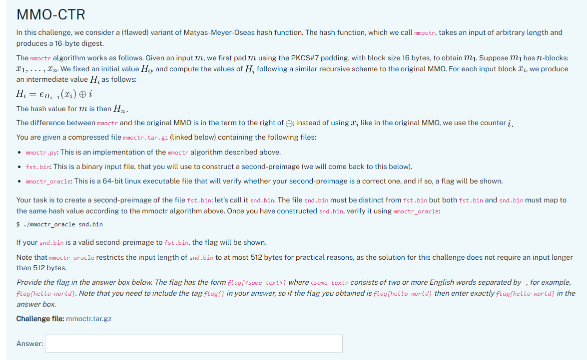

# The problem

# Answer

flag{molten-expertise}

# How

Modify the first data blocks x1, x2.

- Set x1 as fixed value.
- Calc H1_new
- Decrypt xor(H2, 2) with key H1_new.
- The decryt value is x2
- snd.bin be x1 + x2 + data[32:]
